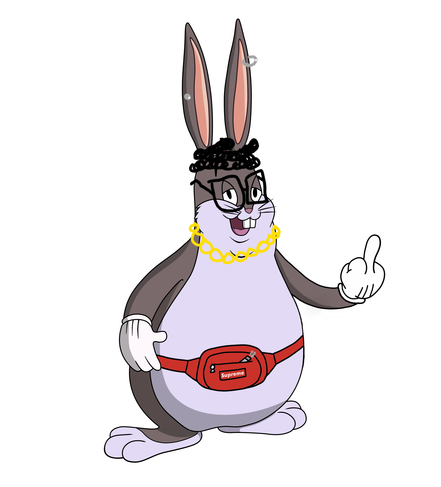

# Mochungus :rabbit:

<link rel="stylesheet" href="readme.css">

This is Chungus:

 click to visit chungus [:earth_asia:](https://mochungusxd.web.app)

| Things He likes | |
|---|---|
| Booze :beer:| 
| Women :girl: | 
| Drugs :syringe: | 
| Malware :see_no_evil: | 

This Project highlights a little about chungus and what he likes. Feel free to
browse around :smiling_imp:

For this Project I used:  

